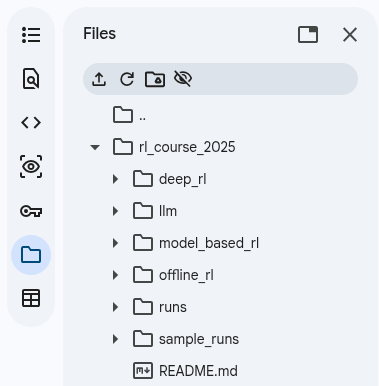

# Running Scripts

## Option 1: Run Locally

### One-time Setup

Make sure Python, PIP and Git are installed.

#### [Optional] Create a Python virtual environment

It is good to install the packages needed for experiments in a separate Python
virtual environment in order not to mess with your main Python installation

```sh
# Create a new environment in `.venv`.
# You can replace `.venv` with any path.
python3 -m venv .venv

# Activate environment
source .venv/bin/activate
```

#### Download code

In an empty directory, run

```sh
git clone https://github.com/ahefny/rl_course_2025.git .
```

#### Installing dependencies

In an empty directory, run one or more of these commands
depending on the experiments you want to run.

```sh
pip install -r deep_rl/requirements.txt
pip install -r llm/requirements.txt
pip install -r model_based_rl/requirements.txt
```

#### Run experiment

```sh
python deep_rl/dqn.py  # To run dqn.py
```

For `deep_rl` experiments that use TensorBoard:
In another terminal run this command to view tensorboard. Open the browser on the output link.

```
tensorboard --logdir runs
```

## Option 2: Run in Colab

- Open the [Colab notebook](https://colab.research.google.com/github/ahefny/rl_course_2025/blob/main/colab/notebook.ipynb).
- [One-time step] Add or remove dependencies as needed. Note that `deep_rl` experiments use a separate `requirements_colab.txt` file.
- Run the tensorboard cell for experiments that use tensorboard.
- Replace the experiment script in the last cell with the script you want to run.


### Editing code in colab

After running the first cell, the downloaded code files can be accessed using "Files" tab.
That can be edited for experimentation.




